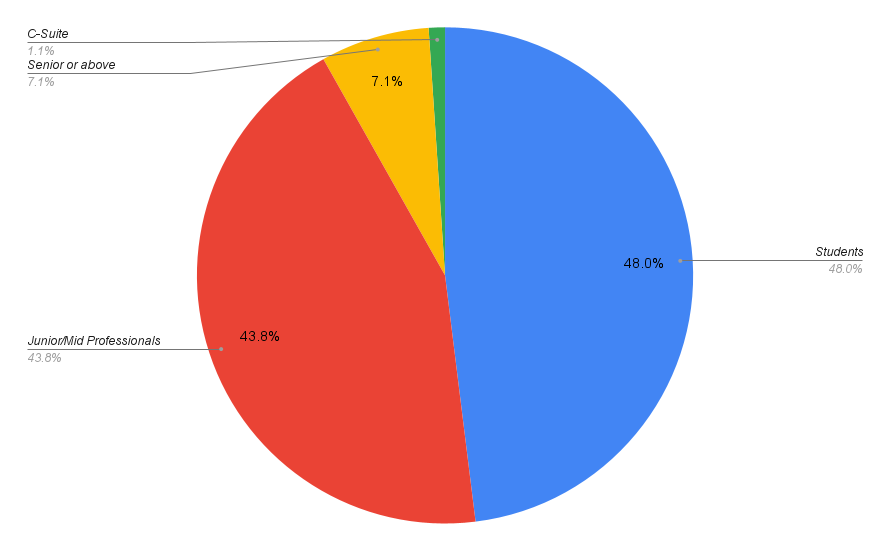
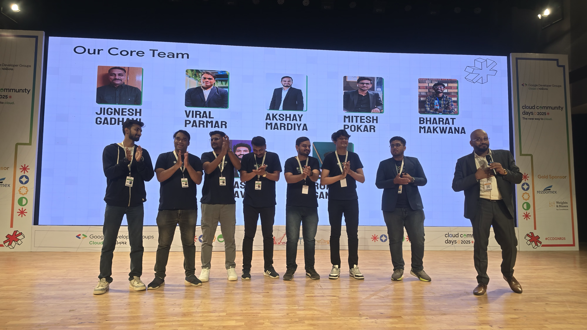
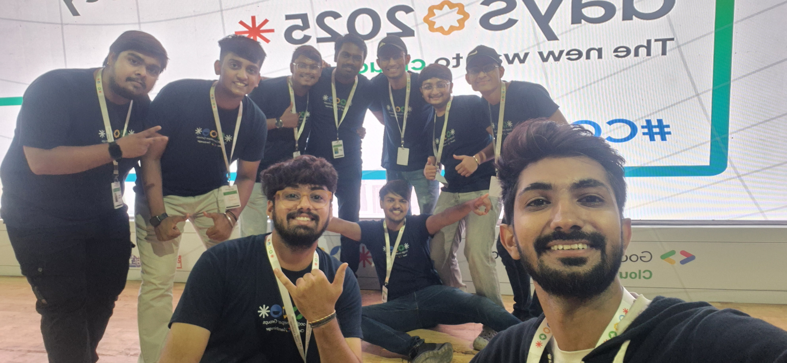
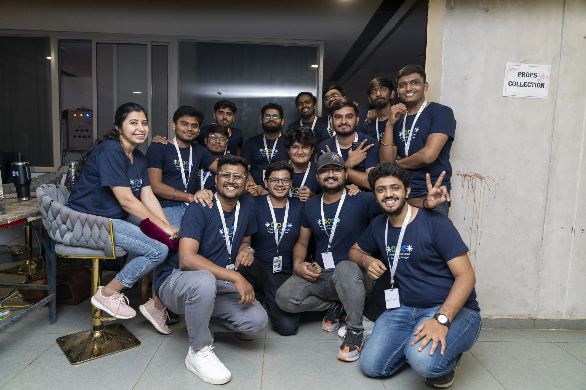
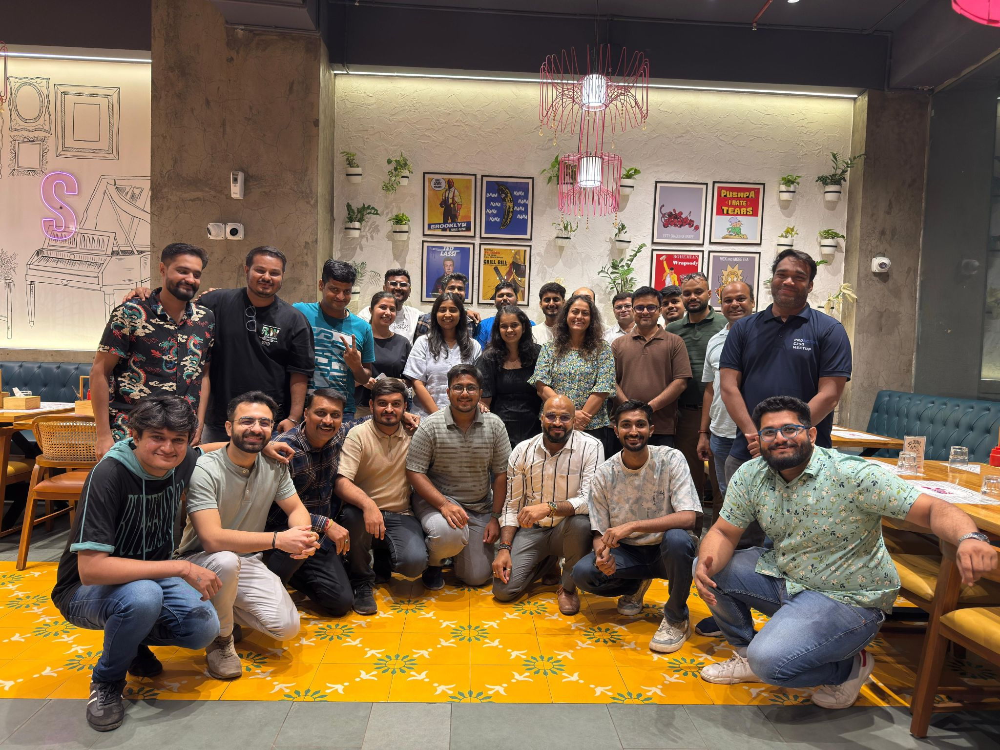

## **[Google Cloud Community Day Gandhinagar 2025](https://gdg.community.dev/events/details/google-gdg-cloud-gandhinagar-presents-google-cloud-community-day-gandhinagar-2025/cohost-gdg-cloud-gandhinagar)**

## Table of Contents

1. [Event Highlights](#event-highlights)
2. [Event Activities](#event-activities)
3. [Social Media Impact](#social-media-impact)
4. [Rockstars Spotlight](#-rockstars-spotlight)
5. [Acknowledgments](#acknowledgments)
6. [Our Avengers (Volunteers)](#our-avengers-volunteers)
7. [Links](#links)

---

### **Event Highlights**

On **July 5, 2025**, Google Cloud Community Day at **Town Hall, Vibrant Gujarat Exhibition Ground** brought together an impressive community of **650+ attendees**. The event featured a diverse mix of approximately **48% students** and **51% professionals**, supported by **5 sponsor companies** and an enthusiastic team of volunteers.

---

### **Event Activities**

Attendees enjoyed a dynamic range of engaging activities designed to foster learning and connection:

-   **Musical Jamming Session** 🎶 — A unique performance by a DevOps Engineer from IBM
-   **Career Opportunities** 🧑‍💼 — Job booths showcasing exciting roles
-   **Dedicated Networking Slots** 🤝 — Meaningful conversations and connections
-   **Hands-on Workshops & Live Demos** 🛠️ — Interactive technical sessions
-   **Interactive Sponsor Booths** 🔬 — Product showcases and demonstrations
-   **Prize Draws & Community Recognition** 🏆 — Celebrating attendee participation

---

### **Social Media Impact**

Our social media channels generated exceptional engagement and reach, amplifying the event's impact across the professional community:

**LinkedIn Performance And Visitor Demographics**

Our event achieved remarkable metrics on LinkedIn, demonstrating strong community interest and engagement:

-   **167,721 impressions** reached across the platform
-   **647.2%📈 organic engagement growth** showcasing authentic community participation

Our event attracted a diverse and highly engaged professional audience:

-   **Entry-level professionals:** 1,168 (32%)
-   **Other professionals:** 1,380 (37.8%)
-   **Senior professionals:** 622 (17%)
-   **Training roles:** 121 (3.3%)
-   **Owners:** 112 (3.1%)
-   **C-level executives:** 99 (2.7%)
-   **Directors:** 69 (1.9%)
-   **Managers:** 61 (1.7%)
-   **Partners:** 17 (< 1%)

#### **Event Hashtag & Community Sentiment**

Attendees actively shared their experiences using **#CCDGN25**, highlighting key learnings on GenAI, Kubernetes, and cloud technologies. The community appreciated the diverse speaker lineup, excellent event organization, memorable networking moments, and the unique musical jamming session.

### 🎙️ **Rockstars Spotlight**

The program featured **7 exceptional speakers** and **2 engaging panel sessions** with **10 industry experts**, along with **2 dynamic hosts**. These sessions delivered valuable insights and actionable knowledge to all attendees.

#### **Meet Our Speakers**

| **Speaker**                                                                                                                                        | **Designation**                                                     | **Session Details**                                                                                                                                                                                                                                                               | **Video Link**                                                    |
| -------------------------------------------------------------------------------------------------------------------------------------------------- | ------------------------------------------------------------------- | --------------------------------------------------------------------------------------------------------------------------------------------------------------------------------------------------------------------------------------------------------------------------------- | ----------------------------------------------------------------- |
| [Saurabh Mishra](https://www.linkedin.com/feed/update/urn:li:activity:7347151216478453760)     | DevOps & Cloud Evangelist @ TYSY                                    | **Building the Future of Intelligent Self-Service Platforms on Google Cloud with AI and Cloud Native** - From virtualization to ChatGPT evolution, covering real-world case studies (ANZ Bank, Spotify) and cloud-native strategies to scale Internal Developer Platforms (IDPs). | [Watch Session](https://youtu.be/WguXE4Or6qY?si=LP9efvMU_fxaNITR) |
| [Ayush Thakur](https://www.linkedin.com/feed/update/urn:li:activity:7347157776395087872)           | Manager, AI Engineer @ Weights & Biases                             | **AI Insights with Weave by W&B** - Deep-dive into LLM system optimization, context engineering, workflow vs agent design, and end-to-end AI-supported workflows with hands-on Weave 101 demo.                                                                                    | [Watch Session](https://youtu.be/2qF_3MfRY7I?si=rcQJu_5KTN8vvG8e) |
| [Namrata More](https://www.linkedin.com/feed/update/urn:li:activity:7347201442539016193)           | Technical Product Manager @ Razorpay                                | **Payments & AI Innovation** - How AI and Google Cloud create smarter, safer, and personalized payment experiences through fighting fraud, designing seamless UX, and building trust with cloud-native architecture.                                                              | [Watch Session](https://youtu.be/vuP1paFhrpM?si=TB7LvwvFwOru2OfW) |
| [Amey Nerkar](https://www.linkedin.com/feed/update/urn:li:activity:7347210100261957632)              | Senior Product Manager @ airpay payment services & GDE for Payments | **Intelligent Payments with Smart AI** - Strategies to tackle payment fraud with AI, ways to personalize payment journeys, and how scalability and trust are engineered from the ground up.                                                                                       | [Watch Session](https://youtu.be/vuP1paFhrpM?si=TB7LvwvFwOru2OfW) |
| [Munjal Patel](https://www.linkedin.com/feed/update/urn:li:activity:7347216523968532481)           | Applied AI App Engineering & Infra @ NVIDIA                         | **Kubernetes + AI = Productivity Unlocked** - "Kubernetes Made Conversational" with kubectl-ai live demo. Includes insights on Helm, K8s Bench, and real examples from NVIDIA's AILeads and ML Infrastructure teams.                                                              | [Watch Session](https://youtu.be/2tYj5TSogM4?si=r-wcN6zmsN48cP_z) |
| [Anubhav Singh](https://www.linkedin.com/feed/update/urn:li:activity:7347498348163039232)        | AI Engineer @ Weights & Biases                                      | **Building Smarter AI Systems** - End-to-end deep-dive into LLM optimization, context engineering, workflow vs agent design, and AI-supported workflows with hands-on experimentation and debugging.                                                                              | [Watch Session](https://youtu.be/2qF_3MfRY7I?si=rcQJu_5KTN8vvG8e) |
| [Nirav Kothari](https://www.linkedin.com/feed/update/urn:li:activity:7347412386435231744)        | Engineering Lead for Data & Analytics @ Quantiphi                   | **Modern Data Architecture Masterclass** - From Lakehouse architecture to Data Mesh paradigm. Real-world applications and strategies for scalable, real-time, cloud-native data solutions.                                                                                        | [Watch Session](https://youtu.be/QF2bBIEZ31A?si=XyuXIP3OqFII4iFc) |

---

**Panel Discussion 1**

1. “Beyond the Buzz – Real Use Cases of hashtag#AI in Business Transformation”

    From streamlining operations and enhancing customer experiences to enabling intelligent growth at scale, our panelists shared actionable insights, challenges faced, and strategies proven in real business environments.

    Panelists:

    1. Ashish Kasama (Founder @ Lucent Innovation )
    2. Sawaram Suthar (Founding Director @ Middleware )
    3. Manish Dudharejia (Founder & President @ E2M )
    4. Dr. Rinkesh Bansal, PhD (Program Director @ IBM )

    Moderator: Zalak Patel (Project Manager @ Skyward Techno Solutions Pvt. Ltd. )

    

    > [Watch Session](https://youtu.be/WSyKykarbEU?si=mU1892K_AU-eZHxA)

**Panel Discussion 2**

2. "Upskilling at Scale: Building AI-Ready Organizations"

    In this engaging panel, industry leaders and education experts come together to discuss how to upskill workforces at scale and build AI-ready organizations capable of thriving in a rapidly evolving digital world.

    Panelists:

    1. Jiten Padmashali — CEO & MD @ Krish TechnoLabs
    2. Devashish Patyal — Deputy CEO @ INTECH
    3. Saumil Shah — Student Services Coordinator @ Deakin University GIFT City Campus
    4. Sarthak Dudhara — Co-founder & CEO @ Aubergine Solutions

    Moderator: Charvee Shah — Project Manager @ Techtic Solutions Inc.

    

    > [Watch Session](https://youtu.be/C-KLN5YT8ao?si=Dy9jaqh-9qNHZ4dU)

#### **Meet Our Hosts**

Our event was brilliantly guided by two exceptional hosts who kept the energy high and ensured seamless flow throughout the day.

[**Jinal Parekh**](https://www.linkedin.com/in/jinal-parekh-a2a0a564/) — Project Manager @ ZealousWeb

Jinal brought exceptional coordination and professionalism to the stage, ensuring seamless transitions between sessions and keeping the audience engaged with her warm presence.

[**Himal Thakker**](https://www.linkedin.com/in/himalthakkar/) — Community Manager @ E2M Solutions

Himal's vibrant energy and community expertise created an inclusive atmosphere, facilitating meaningful interactions between speakers and attendees throughout the day.

---

### **Acknowledgments**

We extend our heartfelt gratitude to everyone who contributed to the success of Google Cloud Community Day Gandhinagar 2025:

#### **Our Supporters**

-   **Google Developer Groups (GDG)** — For their strategic support and partnership
-   **Event Sponsors:**
    -   **Gold Sponsors:** Rezoomex, Weights & Biases
    -   **Silver Sponsors:** Devops Techlabs, Utkrusht
    -   **Digital Partner:** Pict-O-Preserve
    -   **Environment Partner:** Kindlyy
-   **Community Partners**:
    We're grateful to our community partners who helped amplify the event's reach and impact:
    -   Ahmedabad Developer Club (ADC), Google Developer Groups Gandhinagar, Java User Group Gujarat, Exploit Xplorers, Newbie Coders, Laravel Ahmedabad, Google Developer Groups On Campus - Karnavati University, MindMaze, Indian Data Club (IDC), The Hackers Meetup, Open Source Weekend, Hashicorp User Group - Gandhinagar, Cloud Native Community Groups - Gandhinagar, Google Developer Student Clubs - Nirma University, Code-O-Logic

---

### **Our Avengers (Volunteers)**

A heartfelt shoutout to our incredible **50+ volunteers** who dedicated their time and energy to ensure this event's seamless execution. Their passion, commitment, and enthusiasm were the driving force behind creating a truly memorable experience for all attendees.

#### **Organizers**

-   **Drijesh Patel** — Engineering Manager @ IBM

    

-   **Neel Shah** — Developer Advocate @ Middleware

    

#### **Core Team**

-   Jignesh Gadhavi
-   Viral Parmar
-   Akshay Mardiya
-   Mitesh Pokar
-   Bharat Makwana
-   Prasant Bhavsar
-   Ronit Gandhi

#### **Volunteer Teams**

Our dedicated volunteers were organized into specialized teams including Social Media, Graphics Design, Documentation, Marketing, and more. Each team member brought their unique skills and passion to ensure the event's success.

-   Some of the memorable moments captured during the event:
    
    
    
    
    

### **Links**

Stay connected with us across our social media channels:

-   [**LinkedIn**](https://www.linkedin.com/company/99956392) — For professional updates and networking
-   [**Instagram**](https://www.instagram.com/gdgcloudgn/) — For event highlights and community moments
-   [**YouTube**](https://www.youtube.com/@GDGCloudGandhinagar) — For session recordings and tutorials
-   [**Linktree for All Social Links**](https://linktr.ee/gdgcloudgn) — Your gateway to all our channels

---

Thank you to everyone who made Google Cloud Community Day Gandhinagar 2025 an outstanding success! We look forward to seeing you next year for another incredible celebration of cloud technology and community! 🚀

