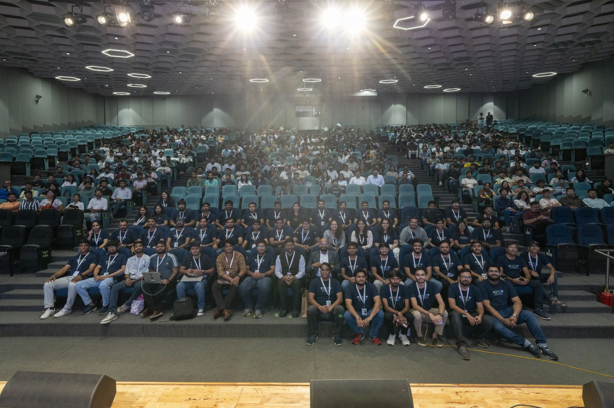
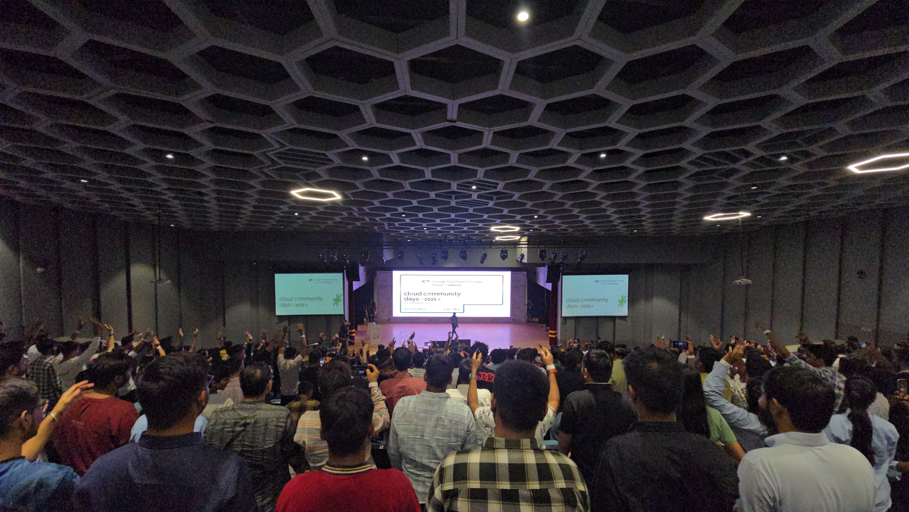
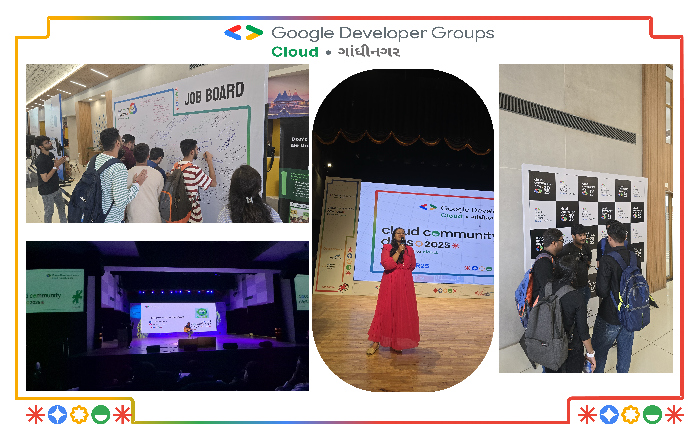
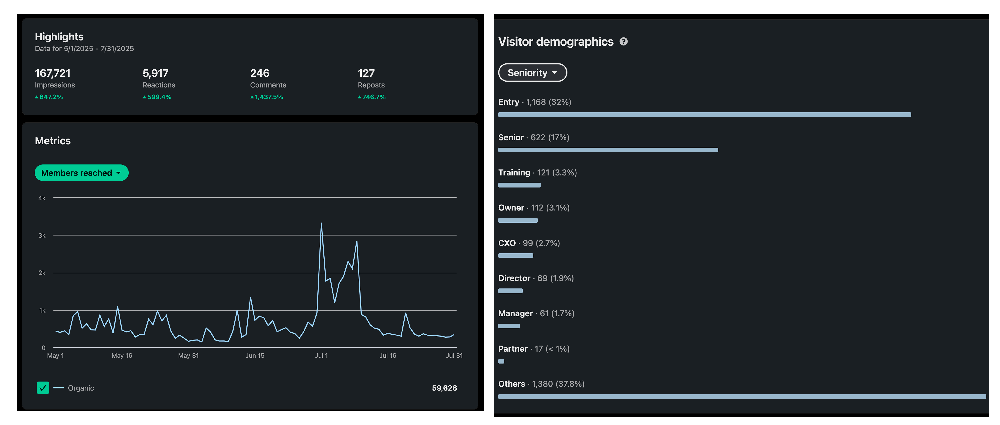
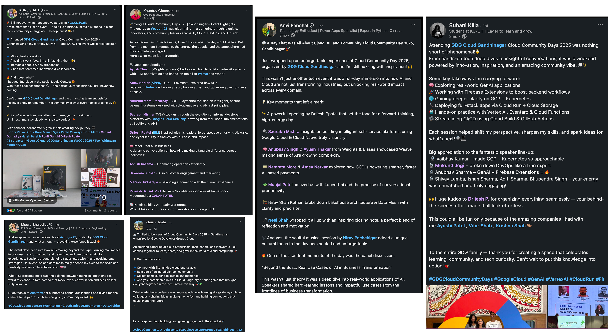
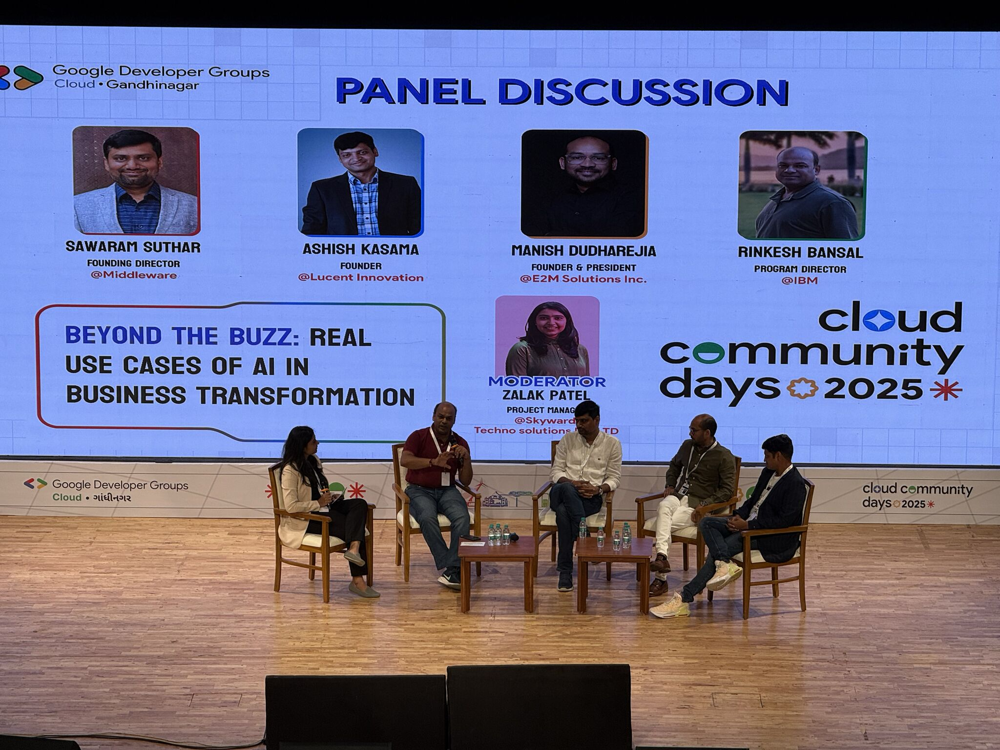
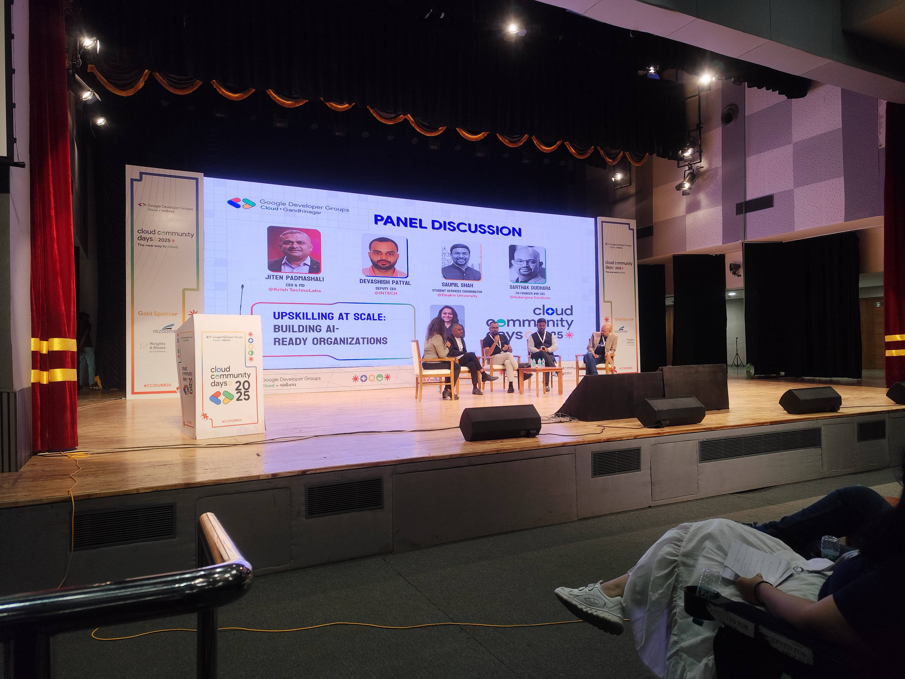
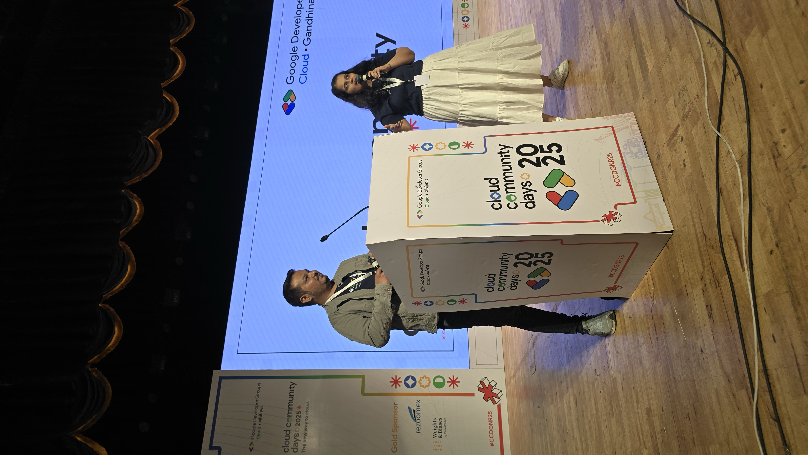
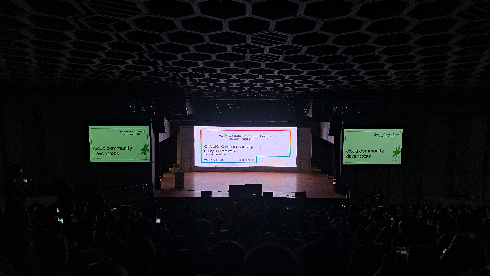

## **[Google Cloud Community Day Gandhinagar 2025](https://gdg.community.dev/events/details/google-gdg-cloud-gandhinagar-presents-google-cloud-community-day-gandhinagar-2025/cohost-gdg-cloud-gandhinagar)**

## Table of Contents

1. [Event Highlights](#event-highlights)
2. [Our Rockstars](#our-rockstars)
3. [Event Activities](#event-activities)
4. [Social Media Impact](#social-media-impact)
5. [Speaker Sessions Links](#speaker-sessions-links)
6. [Speaker Spotlight](#speaker-spotlight)
7. [Testimonials from Our Speakers](#testimonials-from-our-speakers)
8. [Acknowledgments](#acknowledgments)
9. [Cool Facts!](#cool-facts)
10. [Community Partners](#community-partners)
11. [Links to Sessions and Podcasts](#links-to-sessions-and-podcasts)

---

### **Event Highlights**

On July 5, 2025, Google Cloud Community Day at **Town Hall, Vibrant Gujarat Exhibition Ground** drew **650+ attendees**, with approximately **48% students** and **51% professionals**. The event was supported by **5 sponsor companies** and an energetic team of volunteers.

---

### **Our Rockstars**

The program featured **7 speakers** and **2 panel sessions**, including **10 industry experts** and **2 Hosts**. These sessions provided attendees with valuable insights and knowledge.

---

### **Event Activities**

Attendees enjoyed a variety of engaging activities, including:

-   A musical jamming session 🎶(YES you read it right, that too a Devops Engineer from IBM)
-   A job booth 🧑‍💼
-   Dedicated networking slots 🤝
-   Hands-on workshops and live demo stations 🛠️
-   Interactive sponsor booths and product showcases 🔬
-   Prize draws and community recognition moments 🏆

---

### **Social Media Impact**

Our social media channels were abuzz with excitement, reaching thousands across platforms:

-   **LinkedIn Performance:** Our event generated exceptional reach on LinkedIn with **167,721 impressions**, showcasing organic engagement growth of **647.2%**.
    

-   **Visitor Demographics:** Our audience was highly diverse and professional:

    -   **Entry-level professionals:** 1,168 (32%)
    -   **Senior professionals:** 622 (17%)
    -   **Other professionals:** 1,380 (37.8%)
    -   **Training roles:** 121 (3.3%)
    -   **Owners:** 112 (3.1%)
    -   **C-level executives:** 99 (2.7%)
    -   **Directors:** 69 (1.9%)
    -   **Managers:** 61 (1.7%)
    -   **Partners:** 17 (< 1%)

-   **Event Tags:** Attendees shared their event highlights using **#CCDGN25**, including appreciation for the event organization, key learnings on GenAI, Kubernetes, and Cloud technologies, for diverse speakers, and memorable moments from the musical jamming session and panel discussions.

### 🎙️ **Rockstars Spotlight**

**Meet Our Speakers**

| **Speaker**                                                                                                                                        | **Designation**                                                     | **Session Details**                                                                                                                                                                                                                                                               | **Video Link**                                                    |
| -------------------------------------------------------------------------------------------------------------------------------------------------- | ------------------------------------------------------------------- | --------------------------------------------------------------------------------------------------------------------------------------------------------------------------------------------------------------------------------------------------------------------------------- | ----------------------------------------------------------------- |
| [Saurabh Mishra](https://www.linkedin.com/feed/update/urn:li:activity:7347151216478453760)     | DevOps & Cloud Evangelist @ TYSY                                    | **Building the Future of Intelligent Self-Service Platforms on Google Cloud with AI and Cloud Native** - From virtualization to ChatGPT evolution, covering real-world case studies (ANZ Bank, Spotify) and cloud-native strategies to scale Internal Developer Platforms (IDPs). | [Watch Session](https://youtu.be/WguXE4Or6qY?si=LP9efvMU_fxaNITR) |
| [Ayush Thakur](https://www.linkedin.com/feed/update/urn:li:activity:7347157776395087872)           | Manager, AI Engineer @ Weights & Biases                             | **AI Insights with Weave by W&B** - Deep-dive into LLM system optimization, context engineering, workflow vs agent design, and end-to-end AI-supported workflows with hands-on Weave 101 demo.                                                                                    | [Watch Session](https://youtu.be/2qF_3MfRY7I?si=rcQJu_5KTN8vvG8e) |
| [Namrata More](https://www.linkedin.com/feed/update/urn:li:activity:7347201442539016193)           | Technical Product Manager @ Razorpay                                | **Payments & AI Innovation** - How AI and Google Cloud create smarter, safer, and personalized payment experiences through fighting fraud, designing seamless UX, and building trust with cloud-native architecture.                                                              | [Watch Session](https://youtu.be/vuP1paFhrpM?si=TB7LvwvFwOru2OfW) |
| [Amey Nerkar](https://www.linkedin.com/feed/update/urn:li:activity:7347210100261957632)              | Senior Product Manager @ airpay payment services & GDE for Payments | **Intelligent Payments with Smart AI** - Strategies to tackle payment fraud with AI, ways to personalize payment journeys, and how scalability and trust are engineered from the ground up.                                                                                       | [Watch Session](https://youtu.be/vuP1paFhrpM?si=TB7LvwvFwOru2OfW) |
| [Munjal Patel](https://www.linkedin.com/feed/update/urn:li:activity:7347216523968532481)           | Applied AI App Engineering & Infra @ NVIDIA                         | **Kubernetes + AI = Productivity Unlocked** - "Kubernetes Made Conversational" with kubectl-ai live demo. Includes insights on Helm, K8s Bench, and real examples from NVIDIA's AILeads and ML Infrastructure teams.                                                              | [Watch Session](https://youtu.be/2tYj5TSogM4?si=r-wcN6zmsN48cP_z) |
| [Anubhav Singh](https://www.linkedin.com/feed/update/urn:li:activity:7347498348163039232)        | AI Engineer @ Weights & Biases                                      | **Building Smarter AI Systems** - End-to-end deep-dive into LLM optimization, context engineering, workflow vs agent design, and AI-supported workflows with hands-on experimentation and debugging.                                                                              | [Watch Session](https://youtu.be/2qF_3MfRY7I?si=rcQJu_5KTN8vvG8e) |
| [Nirav Kothari](https://www.linkedin.com/feed/update/urn:li:activity:7347412386435231744)        | Engineering Lead for Data & Analytics @ Quantiphi                   | **Modern Data Architecture Masterclass** - From Lakehouse architecture to Data Mesh paradigm. Real-world applications and strategies for scalable, real-time, cloud-native data solutions.                                                                                        | [Watch Session](https://youtu.be/QF2bBIEZ31A?si=XyuXIP3OqFII4iFc) |

---

**Panel Discussion 1**

1. “Beyond the Buzz – Real Use Cases of hashtag#AI in Business Transformation”

    From streamlining operations and enhancing customer experiences to enabling intelligent growth at scale, our panelists shared actionable insights, challenges faced, and strategies proven in real business environments.

    Panelists:

    1. Ashish Kasama (Founder @ Lucent Innovation )
    2. Sawaram Suthar (Founding Director @ Middleware )
    3. Manish Dudharejia (Founder & President @ E2M )
    4. Dr. Rinkesh Bansal, PhD (Program Director @ IBM )

    Moderator: Zalak Patel (Project Manager @ Skyward Techno Solutions Pvt. Ltd. )

    

    > [Watch Session](https://youtu.be/WSyKykarbEU?si=mU1892K_AU-eZHxA)

**Panel Discussion 2**

2. "Upskilling at Scale: Building AI-Ready Organizations"

    In this engaging panel, industry leaders and education experts come together to discuss how to upskill workforces at scale and build AI-ready organizations capable of thriving in a rapidly evolving digital world.

    Panelists:

    1. Jiten Padmashali — CEO & MD @ Krish TechnoLabs
    2. Devashish Patyal — Deputy CEO @ INTECH
    3. Saumil Shah — Student Services Coordinator @ Deakin University GIFT City Campus
    4. Sarthak Dudhara — Co-founder & CEO @ Aubergine Solutions

    Moderator: Charvee Shah — Project Manager @ Techtic Solutions Inc.

    

    > [Watch Session](https://youtu.be/C-KLN5YT8ao?si=Dy9jaqh-9qNHZ4dU)

**Hosts**
**Meet Our Hosts**

Our event was brilliantly guided by two exceptional hosts who kept the energy high and ensured seamless flow throughout the day.

Their combined expertise in project management and community engagement made them the perfect duo to guide attendees through an action-packed day of learning, networking, and innovation.

[**Jinal Parekh**](https://www.linkedin.com/in/jinal-parekh-a2a0a564/) — Project Manager @ ZealousWeb

Jinal brought exceptional coordination and professionalism to the stage, ensuring seamless transitions between sessions and keeping the audience engaged with her warm presence.

[**Himal Thakker**](https://www.linkedin.com/in/himalthakkar/) — Community Manager @ E2M Solutions

Her vibrant energy and community expertise created an inclusive atmosphere, facilitating meaningful interactions between speakers and attendees throughout the day.

### **Acknowledgments**

We would like to extend our heartfelt thanks to:

-   **Google Developer Groups (GDG)** for their support.
-   **Rezoomex** and **Town Hall, Vibrant Gujarat Exhibition Ground**, our sponsors and venue partner.
-   The incredible volunteers and community partners who made this event possible.

---

### **Links**

-   [**LinkedIn**](https://www.linkedin.com/company/99956392)
-   [**Instagram**](https://www.instagram.com/gdgcloudgn/)
-   [**YouTube**](https://www.youtube.com/@GDGCloudGandhinagar)
-   [**Linktree for Social Media**](https://linktr.ee/gdgcloudgn)

Thank you to everyone who made Google Cloud Community Day Gandhinagar 2025 a resounding success! We look forward to seeing you next year!

---
